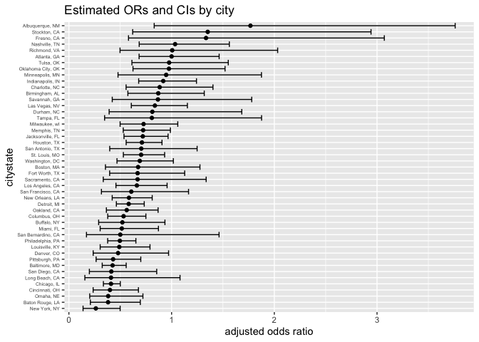

P8105_hw6_yw4200
================
yh wang
2023-11-29

## Problem 1

The Washington Post has gathered data on homicides in 50 large U.S.
cities and made the data available through a GitHub repository here. You
can read their accompanying article here.

Create a city_state variable (e.g. “Baltimore, MD”), and a binary
variable indicating whether the homicide is solved. Omit cities Dallas,
TX; Phoenix, AZ; and Kansas City, MO – these don’t report victim race.
Also omit Tulsa, AL – this is a data entry mistake. For this problem,
limit your analysis those for whom victim_race is white or black. Be
sure that victim_age is numeric.

``` r
library(dplyr)
```

    ## 
    ## Attaching package: 'dplyr'

    ## The following objects are masked from 'package:stats':
    ## 
    ##     filter, lag

    ## The following objects are masked from 'package:base':
    ## 
    ##     intersect, setdiff, setequal, union

``` r
homicide = read.csv("./local data/homicide-data.csv")

# create a city_state variable
homicide_tidy <- homicide |>
  mutate(city_state = paste(city, state, sep = ", "),
         solved_binary = ifelse(disposition == "Closed by arrest",1,0),
         victim_age = as.numeric(victim_age)) |>
  filter(!city_state %in% c("Dallas, TX", "Phoenix, AZ", "Kansas City, MO", "Tulsa, AL")) |>
  filter(victim_race == "White" | victim_race == "Black")
```

    ## Warning: There was 1 warning in `mutate()`.
    ## ℹ In argument: `victim_age = as.numeric(victim_age)`.
    ## Caused by warning:
    ## ! NAs introduced by coercion

``` r
summary(homicide_tidy)
```

    ##      uid            reported_date       victim_last        victim_first      
    ##  Length:39693       Min.   : 20070101   Length:39693       Length:39693      
    ##  Class :character   1st Qu.: 20100404   Class :character   Class :character  
    ##  Mode  :character   Median : 20130108   Mode  :character   Mode  :character  
    ##                     Mean   : 20128858                                        
    ##                     3rd Qu.: 20150917                                        
    ##                     Max.   :201511105                                        
    ##                                                                              
    ##  victim_race          victim_age      victim_sex            city          
    ##  Length:39693       Min.   :  0.00   Length:39693       Length:39693      
    ##  Class :character   1st Qu.: 22.00   Class :character   Class :character  
    ##  Mode  :character   Median : 28.00   Mode  :character   Mode  :character  
    ##                     Mean   : 31.93                                        
    ##                     3rd Qu.: 40.00                                        
    ##                     Max.   :102.00                                        
    ##                     NA's   :290                                           
    ##     state                lat             lon          disposition       
    ##  Length:39693       Min.   :25.73   Min.   :-122.51   Length:39693      
    ##  Class :character   1st Qu.:35.04   1st Qu.: -90.26   Class :character  
    ##  Mode  :character   Median :38.89   Median : -86.84   Mode  :character  
    ##                     Mean   :37.53   Mean   : -88.83                     
    ##                     3rd Qu.:40.65   3rd Qu.: -80.80                     
    ##                     Max.   :45.05   Max.   : -71.01                     
    ##                     NA's   :42      NA's   :42                          
    ##   city_state        solved_binary   
    ##  Length:39693       Min.   :0.0000  
    ##  Class :character   1st Qu.:0.0000  
    ##  Mode  :character   Median :0.0000  
    ##                     Mean   :0.4893  
    ##                     3rd Qu.:1.0000  
    ##                     Max.   :1.0000  
    ## 

For the city of Baltimore, MD, use the glm function to fit a logistic
regression with resolved vs unresolved as the outcome and victim age,
sex and race as predictors. Save the output of glm as an R object; apply
the broom::tidy to this object; and obtain the estimate and confidence
interval of the adjusted odds ratio for solving homicides comparing male
victims to female victims keeping all other variables fixed.

``` r
# prepare the Baltimore, MD data for glm
glm_data <- homicide_tidy |>
  filter(city == "Baltimore") |>
  select(solved_binary, victim_age, victim_race, victim_sex) %>%
  mutate(victim_sex = as.factor(victim_sex))

# glm regression
glm_model1 <- glm(solved_binary ~ victim_age + victim_race + victim_sex, data = glm_data, family = binomial())

save(glm_model1, file = "./result/baltimore_logistic_regression_model.RData")

glm_model1 |>
  broom::tidy() |> 
  knitr::kable(digits = 3)
```

| term             | estimate | std.error | statistic | p.value |
|:-----------------|---------:|----------:|----------:|--------:|
| (Intercept)      |    0.310 |     0.171 |     1.810 |   0.070 |
| victim_age       |   -0.007 |     0.003 |    -2.024 |   0.043 |
| victim_raceWhite |    0.842 |     0.175 |     4.818 |   0.000 |
| victim_sexMale   |   -0.854 |     0.138 |    -6.184 |   0.000 |

``` r
# obtain the estimate and confidence interval of the adjusted odds ratio
glm_model1 |> 
  broom::tidy() |> 
  mutate(OR = exp(estimate),
         OR_lower = exp(estimate - 1.96 * std.error),
         OR_upper = exp(estimate + 1.96 * std.error)) |>
  select(term, log_OR = estimate, OR, OR_lower, OR_upper) |> 
  filter(term == 'victim_sexMale') |>
  knitr::kable(digits = 3)
```

| term           | log_OR |    OR | OR_lower | OR_upper |
|:---------------|-------:|------:|---------:|---------:|
| victim_sexMale | -0.854 | 0.426 |    0.325 |    0.558 |

Now run glm for each of the cities in your dataset, and extract the
adjusted odds ratio (and CI) for solving homicides comparing male
victims to female victims. Do this within a “tidy” pipeline, making use
of purrr::map, list columns, and unnest as necessary to create a
dataframe with estimated ORs and CIs for each city.

``` r
library(tidyr) 
library(purrr)
# fit logistic regression for all city
city_model <- homicide_tidy |>
   nest(data = -city_state) |>
  mutate(
    fit = map(.x = data, ~ glm(solved_binary ~ victim_age + victim_sex + victim_race, data = ., family = binomial())),output = map(fit, broom::tidy)
  ) |>
  unnest(cols = output) |>
  mutate(citystate = city_state,
         OR = exp(estimate),
         OR_lower = exp(estimate - 1.96 * std.error),
         OR_upper = exp(estimate + 1.96 * std.error)) |>
  select(citystate, term, log_OR = estimate, OR, OR_lower, OR_upper) |> 
  filter(term == 'victim_sexMale') |>
  arrange(desc(OR))

city_model |> knitr::kable(digits = 3)
```

| citystate          | term           | log_OR |    OR | OR_lower | OR_upper |
|:-------------------|:---------------|-------:|------:|---------:|---------:|
| Albuquerque, NM    | victim_sexMale |  0.570 | 1.767 |    0.831 |    3.761 |
| Stockton, CA       | victim_sexMale |  0.301 | 1.352 |    0.621 |    2.942 |
| Fresno, CA         | victim_sexMale |  0.289 | 1.335 |    0.580 |    3.071 |
| Nashville, TN      | victim_sexMale |  0.034 | 1.034 |    0.685 |    1.562 |
| Richmond, VA       | victim_sexMale |  0.006 | 1.006 |    0.498 |    2.033 |
| Atlanta, GA        | victim_sexMale |  0.000 | 1.000 |    0.684 |    1.463 |
| Tulsa, OK          | victim_sexMale | -0.025 | 0.976 |    0.614 |    1.552 |
| Oklahoma City, OK  | victim_sexMale | -0.026 | 0.974 |    0.624 |    1.520 |
| Minneapolis, MN    | victim_sexMale | -0.054 | 0.947 |    0.478 |    1.875 |
| Indianapolis, IN   | victim_sexMale | -0.085 | 0.919 |    0.679 |    1.242 |
| Charlotte, NC      | victim_sexMale | -0.123 | 0.884 |    0.557 |    1.403 |
| Birmingham, AL     | victim_sexMale | -0.139 | 0.870 |    0.574 |    1.318 |
| Savannah, GA       | victim_sexMale | -0.143 | 0.867 |    0.422 |    1.780 |
| Las Vegas, NV      | victim_sexMale | -0.178 | 0.837 |    0.608 |    1.154 |
| Durham, NC         | victim_sexMale | -0.208 | 0.812 |    0.392 |    1.683 |
| Tampa, FL          | victim_sexMale | -0.214 | 0.808 |    0.348 |    1.876 |
| Milwaukee, wI      | victim_sexMale | -0.319 | 0.727 |    0.499 |    1.060 |
| Memphis, TN        | victim_sexMale | -0.324 | 0.723 |    0.529 |    0.988 |
| Jacksonville, FL   | victim_sexMale | -0.329 | 0.720 |    0.537 |    0.966 |
| Houston, TX        | victim_sexMale | -0.341 | 0.711 |    0.558 |    0.907 |
| San Antonio, TX    | victim_sexMale | -0.350 | 0.705 |    0.398 |    1.249 |
| St. Louis, MO      | victim_sexMale | -0.352 | 0.703 |    0.530 |    0.932 |
| Washington, DC     | victim_sexMale | -0.371 | 0.690 |    0.468 |    1.017 |
| Boston, MA         | victim_sexMale | -0.395 | 0.674 |    0.356 |    1.276 |
| Fort Worth, TX     | victim_sexMale | -0.402 | 0.669 |    0.397 |    1.127 |
| Sacramento, CA     | victim_sexMale | -0.402 | 0.669 |    0.335 |    1.337 |
| Los Angeles, CA    | victim_sexMale | -0.413 | 0.662 |    0.458 |    0.956 |
| San Francisco, CA  | victim_sexMale | -0.498 | 0.608 |    0.317 |    1.165 |
| New Orleans, LA    | victim_sexMale | -0.536 | 0.585 |    0.422 |    0.811 |
| Detroit, MI        | victim_sexMale | -0.541 | 0.582 |    0.462 |    0.734 |
| Oakland, CA        | victim_sexMale | -0.574 | 0.563 |    0.365 |    0.868 |
| Columbus, OH       | victim_sexMale | -0.630 | 0.532 |    0.378 |    0.750 |
| Buffalo, NY        | victim_sexMale | -0.653 | 0.521 |    0.290 |    0.935 |
| Miami, FL          | victim_sexMale | -0.663 | 0.515 |    0.304 |    0.872 |
| San Bernardino, CA | victim_sexMale | -0.692 | 0.500 |    0.171 |    1.462 |
| Philadelphia, PA   | victim_sexMale | -0.701 | 0.496 |    0.378 |    0.652 |
| Louisville, KY     | victim_sexMale | -0.712 | 0.491 |    0.305 |    0.790 |
| Denver, CO         | victim_sexMale | -0.736 | 0.479 |    0.236 |    0.971 |
| Pittsburgh, PA     | victim_sexMale | -0.842 | 0.431 |    0.265 |    0.700 |
| Baltimore, MD      | victim_sexMale | -0.854 | 0.426 |    0.325 |    0.558 |
| San Diego, CA      | victim_sexMale | -0.884 | 0.413 |    0.200 |    0.855 |
| Long Beach, CA     | victim_sexMale | -0.891 | 0.410 |    0.156 |    1.082 |
| Chicago, IL        | victim_sexMale | -0.891 | 0.410 |    0.336 |    0.501 |
| Cincinnati, OH     | victim_sexMale | -0.917 | 0.400 |    0.236 |    0.677 |
| Omaha, NE          | victim_sexMale | -0.961 | 0.382 |    0.203 |    0.721 |
| Baton Rouge, LA    | victim_sexMale | -0.964 | 0.381 |    0.209 |    0.695 |
| New York, NY       | victim_sexMale | -1.338 | 0.262 |    0.138 |    0.499 |

Create a plot that shows the estimated ORs and CIs for each city.
Organize cities according to estimated OR, and comment on the plot.

``` r
library(forcats)
library(ggplot2)
ggplot(city_model, aes(x = fct_reorder(citystate, OR), y= OR)) +
  geom_point() +
  geom_errorbar(aes(ymin = OR_lower, ymax = OR_upper)) +
  coord_flip() +
  labs(x = 'citystate', y = 'adjusted odds ratio', title = 'Estimated ORs and CIs by city') +
  theme(axis.text.y = element_text(hjust = 1,size = 5))
```

<!-- -->

## Problem 2

For this problem, we’ll use the Central Park weather data similar to
data we’ve seen elsewhere. The code chunk below (adapted from the course
website) will download these data.

``` r
weather_df = 
  rnoaa::meteo_pull_monitors(
    c("USW00094728"),
    var = c("PRCP", "TMIN", "TMAX"), 
    date_min = "2022-01-01",
    date_max = "2022-12-31") |>
  mutate(
    name = recode(id, USW00094728 = "CentralPark_NY"),
    tmin = tmin / 10,
    tmax = tmax / 10) |>
  select(name, id, everything())
```

    ## using cached file: /Users/ivonne/Library/Caches/org.R-project.R/R/rnoaa/noaa_ghcnd/USW00094728.dly

    ## date created (size, mb): 2023-09-28 10:20:50.293185 (8.524)

    ## file min/max dates: 1869-01-01 / 2023-09-30

``` r
head(weather_df)
```

    ## # A tibble: 6 × 6
    ##   name           id          date        prcp  tmax  tmin
    ##   <chr>          <chr>       <date>     <dbl> <dbl> <dbl>
    ## 1 CentralPark_NY USW00094728 2022-01-01   201  13.3  10  
    ## 2 CentralPark_NY USW00094728 2022-01-02    10  15     2.8
    ## 3 CentralPark_NY USW00094728 2022-01-03     0   2.8  -5.5
    ## 4 CentralPark_NY USW00094728 2022-01-04     0   1.1  -7.1
    ## 5 CentralPark_NY USW00094728 2022-01-05    58   8.3  -0.5
    ## 6 CentralPark_NY USW00094728 2022-01-06     0   5     1.1

Use 5000 bootstrap samples and, for each bootstrap sample, produce
estimates of these two quantities. Plot the distribution of your
estimates, and describe these in words. Using the 5000 bootstrap
estimates, identify the 2.5% and 97.5% quantiles to provide a 95%
confidence interval for r̂ 2 and log(β̂ 0∗β̂ 1). Note: broom::glance() is
helpful for extracting r̂ 2 from a fitted regression, and broom::tidy()
(with some additional wrangling) should help in computing log(β̂ 1∗β̂ 2)

``` r
# create 5000 bootstrap samples and produce estimates
set.seed(123)

bootstrap_estimates <- weather_df |>
  modelr::bootstrap(n = 5000) |>
  mutate(model = map(strap, ~lm(tmax ~ tmin +prcp, data = .x)),
         result_tidy= map(model, broom::tidy),
         result_glance = map(model, broom::glance)) |>
  unnest(result_tidy,result_glance) |>
  select(.id, term, estimate, r.squared) |>
  pivot_wider(names_from = term, values_from = estimate) |>
  rename(
    beta_0 = `(Intercept)`,
    beta_1 = tmin,
    beta_2 = prcp) 
```

    ## Warning: `unnest()` has a new interface. See `?unnest` for details.
    ## ℹ Try `df %>% unnest(c(result_tidy, result_glance))`, with `mutate()` if
    ##   needed.

``` r
result_boot = bootstrap_estimates |>
  mutate(r.squared = r.squared,
    log_beta12 = log(beta_1 * beta_2))
```

    ## Warning: There was 1 warning in `mutate()`.
    ## ℹ In argument: `log_beta12 = log(beta_1 * beta_2)`.
    ## Caused by warning in `log()`:
    ## ! NaNs produced

``` r
result_filter = result_boot |>
  na.omit()

head(result_boot)
```

    ## # A tibble: 6 × 6
    ##   .id   r.squared beta_0 beta_1   beta_2 log_beta12
    ##   <chr>     <dbl>  <dbl>  <dbl>    <dbl>      <dbl>
    ## 1 0001      0.916   8.07  1.02  -0.00306     NaN   
    ## 2 0002      0.914   8.05  1.01  -0.00188     NaN   
    ## 3 0003      0.931   7.41  1.04   0.00376      -5.55
    ## 4 0004      0.905   8.44  0.995 -0.00555     NaN   
    ## 5 0005      0.927   7.87  1.01   0.00161      -6.43
    ## 6 0006      0.908   8.11  1.01   0.00409      -5.49

``` r
head(result_filter)
```

    ## # A tibble: 6 × 6
    ##   .id   r.squared beta_0 beta_1  beta_2 log_beta12
    ##   <chr>     <dbl>  <dbl>  <dbl>   <dbl>      <dbl>
    ## 1 0003      0.931   7.41  1.04  0.00376      -5.55
    ## 2 0005      0.927   7.87  1.01  0.00161      -6.43
    ## 3 0006      0.908   8.11  1.01  0.00409      -5.49
    ## 4 0013      0.900   8.56  0.995 0.00350      -5.66
    ## 5 0016      0.912   8.11  1.02  0.00157      -6.44
    ## 6 0017      0.913   8.20  1.01  0.00203      -6.19

``` r
# identify the 2.5% and 97.5% quantiles to provide a 95% confidence interval

# CI for R_2 
  quantile(pull(result_boot,r.squared), probs = c(0.025,0.975),na.rm = TRUE) |>
  knitr::kable(digits = 5, col.names = "R_squared")
```

|       | R_squared |
|:------|----------:|
| 2.5%  |   0.88821 |
| 97.5% |   0.94026 |

``` r
# CI for R_2 without NA
  quantile(pull(result_filter,r.squared), probs = c(0.025,0.975),na.rm = TRUE) |>
  knitr::kable(digits = 5, col.names = "R_squared")
```

|       | R_squared |
|:------|----------:|
| 2.5%  |   0.88093 |
| 97.5% |   0.92645 |

``` r
# CI for log(beta1*beta2)
  quantile(pull(result_filter,log_beta12), probs = c(0.025,0.975),na.rm = TRUE) |>
  knitr::kable(digits = 5,  col.names = "log(beta1*beta2)")
```

|       | log(beta1\*beta2) |
|:------|------------------:|
| 2.5%  |          -9.06321 |
| 97.5% |          -4.61927 |

``` r
# Plot the distribution of estimates
result_boot |>
  ggplot(aes(x = r.squared)) + 
  geom_density() +
  labs(
    title = "Distribution of Estimates of R_squared",
    x = "Estimates of R_squared",
    y = "Density"
  )
```

<!-- -->
Comment: The distribution of R_squared is approximately normal
distribution but a little left-skewed. The value of R_squared is close
to 0.92, which means there are strong linear relation between tmax and
its predictors(tmin and prcp). It indicates that approximately 92% of
the variability in the response variable `tmax` can be explained by
predictor variables `tmin` and `prcp` included in the regression model.

``` r
# Plot the distribution of log(beta1*beta2)
result_filter |>
  ggplot(aes(x = log_beta12)) + 
  geom_density() +
  labs(
    title = "Distribution of Estimates of log(beta1*beta2)",
    x = "Estimates of log(beta1*beta2)",
    y = "Density"
  )
```

<!-- -->
Comment: The distribution is left-skewed with the mean of -6.1059669 and
the sd of 1.1136377. There are some outliers, so the large samples are
useful.

## Problem 3

In this problem, you will analyze data gathered to understand the
effects of several variables on a child’s birthweight. This dataset,
available here, consists of roughly 4000 children and includes the
following variables.

Load and clean the data for regression analysis (i.e. convert numeric to
factor where appropriate, check for missing data, etc.).

``` r
# import and clean data
birthweight = read.csv("./local data/birthweight.csv")

# check for missing data
missing_data <- sapply(birthweight, function(x) sum(is.na(x)))
missing_data
```

    ##  babysex    bhead  blength      bwt    delwt  fincome    frace  gaweeks 
    ##        0        0        0        0        0        0        0        0 
    ##  malform menarche  mheight   momage    mrace   parity  pnumlbw  pnumsga 
    ##        0        0        0        0        0        0        0        0 
    ##    ppbmi     ppwt   smoken   wtgain 
    ##        0        0        0        0

``` r
# convert some numeric into factor and label them
birth_clean <- birthweight |> 
  janitor::clean_names() |>
  mutate(babysex = factor(babysex, levels = c(2, 1), 
                     labels = c("Female", "Male")),
    frace = factor(frace, levels = c(1, 2, 3, 4, 8, 9), 
                   labels = c("White", "Black", "Asian", 
                              "Puerto Rican", "Other", "Unknown")),
    mrace = factor(mrace, levels = c(1, 2, 3, 4, 8), 
                   labels = c("White", "Black", "Asian", "Puerto Rican", "Other")),
    malform = factor(malform, levels = c(0, 1), labels = c("Absent", "Present")))

head(birth_clean)
```

    ##   babysex bhead blength  bwt delwt fincome frace gaweeks malform menarche
    ## 1  Female    34      51 3629   177      35 White    39.9  Absent       13
    ## 2    Male    34      48 3062   156      65 Black    25.9  Absent       14
    ## 3  Female    36      50 3345   148      85 White    39.9  Absent       12
    ## 4    Male    34      52 3062   157      55 White    40.0  Absent       14
    ## 5  Female    34      52 3374   156       5 White    41.6  Absent       13
    ## 6    Male    33      52 3374   129      55 White    40.7  Absent       12
    ##   mheight momage mrace parity pnumlbw pnumsga    ppbmi ppwt smoken wtgain
    ## 1      63     36 White      3       0       0 26.27184  148      0     29
    ## 2      65     25 Black      0       0       0 21.34485  128      0     28
    ## 3      64     29 White      0       0       0 23.56517  137      1     11
    ## 4      64     18 White      0       0       0 21.84508  127     10     30
    ## 5      66     20 White      0       0       0 21.02642  130      1     26
    ## 6      66     23 White      0       0       0 18.60030  115      0     14

Propose a regression model for birthweight. This model may be based on a
hypothesized structure for the factors that underly birthweight, on a
data-driven model-building process, or a combination of the two.
Describe your modeling process and show a plot of model residuals
against fitted values – use add_predictions and add_residuals in making
this plot.

``` r
# Propose a regression model for birthweight
# First consider a model with the main effects of all variables and then use stepwise regression to select appropriate variables

# full model
model_all <- lm(bwt ~ ., data = birth_clean)

# stepwise regression
model_stepwise <- step(model_all, direction = "backward")
```

    ## Start:  AIC=48717.83
    ## bwt ~ babysex + bhead + blength + delwt + fincome + frace + gaweeks + 
    ##     malform + menarche + mheight + momage + mrace + parity + 
    ##     pnumlbw + pnumsga + ppbmi + ppwt + smoken + wtgain
    ## 
    ## 
    ## Step:  AIC=48717.83
    ## bwt ~ babysex + bhead + blength + delwt + fincome + frace + gaweeks + 
    ##     malform + menarche + mheight + momage + mrace + parity + 
    ##     pnumlbw + pnumsga + ppbmi + ppwt + smoken
    ## 
    ## 
    ## Step:  AIC=48717.83
    ## bwt ~ babysex + bhead + blength + delwt + fincome + frace + gaweeks + 
    ##     malform + menarche + mheight + momage + mrace + parity + 
    ##     pnumlbw + ppbmi + ppwt + smoken
    ## 
    ## 
    ## Step:  AIC=48717.83
    ## bwt ~ babysex + bhead + blength + delwt + fincome + frace + gaweeks + 
    ##     malform + menarche + mheight + momage + mrace + parity + 
    ##     ppbmi + ppwt + smoken
    ## 
    ##            Df Sum of Sq       RSS   AIC
    ## - frace     4    124365 320848704 48712
    ## - malform   1      1419 320725757 48716
    ## - ppbmi     1      6346 320730684 48716
    ## - momage    1     28661 320752999 48716
    ## - mheight   1     66886 320791224 48717
    ## - menarche  1    111679 320836018 48717
    ## - ppwt      1    131132 320855470 48718
    ## <none>                  320724338 48718
    ## - fincome   1    193454 320917792 48718
    ## - parity    1    413584 321137922 48721
    ## - mrace     3    868321 321592659 48724
    ## - babysex   1    853796 321578134 48727
    ## - gaweeks   1   4611823 325336161 48778
    ## - smoken    1   5076393 325800732 48784
    ## - delwt     1   8008891 328733230 48823
    ## - blength   1 102050296 422774634 49915
    ## - bhead     1 106535716 427260054 49961
    ## 
    ## Step:  AIC=48711.51
    ## bwt ~ babysex + bhead + blength + delwt + fincome + gaweeks + 
    ##     malform + menarche + mheight + momage + mrace + parity + 
    ##     ppbmi + ppwt + smoken
    ## 
    ##            Df Sum of Sq       RSS   AIC
    ## - malform   1      1447 320850151 48710
    ## - ppbmi     1      6975 320855679 48710
    ## - momage    1     28379 320877083 48710
    ## - mheight   1     69502 320918206 48710
    ## - menarche  1    115708 320964411 48711
    ## - ppwt      1    133961 320982665 48711
    ## <none>                  320848704 48712
    ## - fincome   1    194405 321043108 48712
    ## - parity    1    414687 321263390 48715
    ## - babysex   1    852133 321700837 48721
    ## - gaweeks   1   4625208 325473911 48772
    ## - smoken    1   5036389 325885093 48777
    ## - delwt     1   8013099 328861802 48817
    ## - mrace     3  13540415 334389119 48885
    ## - blength   1 101995688 422844392 49908
    ## - bhead     1 106662962 427511666 49956
    ## 
    ## Step:  AIC=48709.53
    ## bwt ~ babysex + bhead + blength + delwt + fincome + gaweeks + 
    ##     menarche + mheight + momage + mrace + parity + ppbmi + ppwt + 
    ##     smoken
    ## 
    ##            Df Sum of Sq       RSS   AIC
    ## - ppbmi     1      6928 320857079 48708
    ## - momage    1     28660 320878811 48708
    ## - mheight   1     69320 320919470 48708
    ## - menarche  1    116027 320966177 48709
    ## - ppwt      1    133894 320984044 48709
    ## <none>                  320850151 48710
    ## - fincome   1    193784 321043934 48710
    ## - parity    1    414482 321264633 48713
    ## - babysex   1    851279 321701430 48719
    ## - gaweeks   1   4624003 325474154 48770
    ## - smoken    1   5035195 325885346 48775
    ## - delwt     1   8029079 328879230 48815
    ## - mrace     3  13553320 334403471 48883
    ## - blength   1 102009225 422859375 49906
    ## - bhead     1 106675331 427525481 49954
    ## 
    ## Step:  AIC=48707.63
    ## bwt ~ babysex + bhead + blength + delwt + fincome + gaweeks + 
    ##     menarche + mheight + momage + mrace + parity + ppwt + smoken
    ## 
    ##            Df Sum of Sq       RSS   AIC
    ## - momage    1     29211 320886290 48706
    ## - menarche  1    117635 320974714 48707
    ## <none>                  320857079 48708
    ## - fincome   1    195199 321052278 48708
    ## - parity    1    412984 321270064 48711
    ## - babysex   1    850020 321707099 48717
    ## - mheight   1   1078673 321935752 48720
    ## - ppwt      1   2934023 323791103 48745
    ## - gaweeks   1   4621504 325478583 48768
    ## - smoken    1   5039368 325896447 48773
    ## - delwt     1   8024939 328882018 48813
    ## - mrace     3  13551444 334408523 48881
    ## - blength   1 102018559 422875638 49904
    ## - bhead     1 106821342 427678421 49953
    ## 
    ## Step:  AIC=48706.02
    ## bwt ~ babysex + bhead + blength + delwt + fincome + gaweeks + 
    ##     menarche + mheight + mrace + parity + ppwt + smoken
    ## 
    ##            Df Sum of Sq       RSS   AIC
    ## - menarche  1    100121 320986412 48705
    ## <none>                  320886290 48706
    ## - fincome   1    240800 321127090 48707
    ## - parity    1    431433 321317724 48710
    ## - babysex   1    841278 321727568 48715
    ## - mheight   1   1076739 321963029 48719
    ## - ppwt      1   2913653 323799943 48743
    ## - gaweeks   1   4676469 325562760 48767
    ## - smoken    1   5045104 325931394 48772
    ## - delwt     1   8000672 328886962 48811
    ## - mrace     3  14667730 335554021 48894
    ## - blength   1 101990556 422876847 49902
    ## - bhead     1 106864308 427750598 49952
    ## 
    ## Step:  AIC=48705.38
    ## bwt ~ babysex + bhead + blength + delwt + fincome + gaweeks + 
    ##     mheight + mrace + parity + ppwt + smoken
    ## 
    ##           Df Sum of Sq       RSS   AIC
    ## <none>                 320986412 48705
    ## - fincome  1    245637 321232048 48707
    ## - parity   1    422770 321409181 48709
    ## - babysex  1    846134 321832545 48715
    ## - mheight  1   1012240 321998651 48717
    ## - ppwt     1   2907049 323893461 48743
    ## - gaweeks  1   4662501 325648912 48766
    ## - smoken   1   5073849 326060260 48771
    ## - delwt    1   8137459 329123871 48812
    ## - mrace    3  14683609 335670021 48894
    ## - blength  1 102191779 423178191 49903
    ## - bhead    1 106779754 427766166 49950

``` r
model_all |> 
  broom::tidy() |>
  knitr::kable(digits = 3)
```

| term              |  estimate | std.error | statistic | p.value |
|:------------------|----------:|----------:|----------:|--------:|
| (Intercept)       | -6236.684 |   660.188 |    -9.447 |   0.000 |
| babysexMale       |   -28.707 |     8.465 |    -3.391 |   0.001 |
| bhead             |   130.778 |     3.452 |    37.881 |   0.000 |
| blength           |    74.954 |     2.022 |    37.075 |   0.000 |
| delwt             |     4.101 |     0.395 |    10.386 |   0.000 |
| fincome           |     0.290 |     0.180 |     1.614 |   0.107 |
| fraceBlack        |    14.331 |    46.150 |     0.311 |   0.756 |
| fraceAsian        |    21.236 |    69.296 |     0.306 |   0.759 |
| fracePuerto Rican |   -46.996 |    44.678 |    -1.052 |   0.293 |
| fraceOther        |     4.297 |    74.074 |     0.058 |   0.954 |
| gaweeks           |    11.549 |     1.465 |     7.882 |   0.000 |
| malformPresent    |     9.765 |    70.626 |     0.138 |   0.890 |
| menarche          |    -3.551 |     2.895 |    -1.226 |   0.220 |
| mheight           |     9.787 |    10.312 |     0.949 |   0.343 |
| momage            |     0.759 |     1.222 |     0.621 |   0.534 |
| mraceBlack        |  -151.435 |    46.045 |    -3.289 |   0.001 |
| mraceAsian        |   -91.387 |    71.919 |    -1.271 |   0.204 |
| mracePuerto Rican |   -56.479 |    45.137 |    -1.251 |   0.211 |
| parity            |    95.541 |    40.479 |     2.360 |   0.018 |
| pnumlbw           |        NA |        NA |        NA |      NA |
| pnumsga           |        NA |        NA |        NA |      NA |
| ppbmi             |     4.354 |    14.891 |     0.292 |   0.770 |
| ppwt              |    -3.472 |     2.612 |    -1.329 |   0.184 |
| smoken            |    -4.854 |     0.587 |    -8.269 |   0.000 |
| wtgain            |        NA |        NA |        NA |      NA |

``` r
summary(model_stepwise)
```

    ## 
    ## Call:
    ## lm(formula = bwt ~ babysex + bhead + blength + delwt + fincome + 
    ##     gaweeks + mheight + mrace + parity + ppwt + smoken, data = birth_clean)
    ## 
    ## Residuals:
    ##      Min       1Q   Median       3Q      Max 
    ## -1097.18  -185.52    -3.39   174.14  2353.44 
    ## 
    ## Coefficients:
    ##                     Estimate Std. Error t value Pr(>|t|)    
    ## (Intercept)       -6070.2639   136.9081 -44.338  < 2e-16 ***
    ## babysexMale         -28.5580     8.4549  -3.378 0.000737 ***
    ## bhead               130.7770     3.4466  37.944  < 2e-16 ***
    ## blength              74.9471     2.0190  37.120  < 2e-16 ***
    ## delwt                 4.1067     0.3921  10.475  < 2e-16 ***
    ## fincome               0.3180     0.1747   1.820 0.068844 .  
    ## gaweeks              11.5925     1.4621   7.929 2.79e-15 ***
    ## mheight               6.5940     1.7849   3.694 0.000223 ***
    ## mraceBlack         -138.7925     9.9071 -14.009  < 2e-16 ***
    ## mraceAsian          -74.8868    42.3146  -1.770 0.076837 .  
    ## mracePuerto Rican  -100.6781    19.3247  -5.210 1.98e-07 ***
    ## parity               96.3047    40.3362   2.388 0.017004 *  
    ## ppwt                 -2.6756     0.4274  -6.261 4.20e-10 ***
    ## smoken               -4.8434     0.5856  -8.271  < 2e-16 ***
    ## ---
    ## Signif. codes:  0 '***' 0.001 '**' 0.01 '*' 0.05 '.' 0.1 ' ' 1
    ## 
    ## Residual standard error: 272.3 on 4328 degrees of freedom
    ## Multiple R-squared:  0.7181, Adjusted R-squared:  0.7173 
    ## F-statistic: 848.1 on 13 and 4328 DF,  p-value: < 2.2e-16

``` r
model_stepwise |> 
  broom::tidy() |> 
  knitr::kable(digits = 3)
```

| term              |  estimate | std.error | statistic | p.value |
|:------------------|----------:|----------:|----------:|--------:|
| (Intercept)       | -6070.264 |   136.908 |   -44.338 |   0.000 |
| babysexMale       |   -28.558 |     8.455 |    -3.378 |   0.001 |
| bhead             |   130.777 |     3.447 |    37.944 |   0.000 |
| blength           |    74.947 |     2.019 |    37.120 |   0.000 |
| delwt             |     4.107 |     0.392 |    10.475 |   0.000 |
| fincome           |     0.318 |     0.175 |     1.820 |   0.069 |
| gaweeks           |    11.592 |     1.462 |     7.929 |   0.000 |
| mheight           |     6.594 |     1.785 |     3.694 |   0.000 |
| mraceBlack        |  -138.792 |     9.907 |   -14.009 |   0.000 |
| mraceAsian        |   -74.887 |    42.315 |    -1.770 |   0.077 |
| mracePuerto Rican |  -100.678 |    19.325 |    -5.210 |   0.000 |
| parity            |    96.305 |    40.336 |     2.388 |   0.017 |
| ppwt              |    -2.676 |     0.427 |    -6.261 |   0.000 |
| smoken            |    -4.843 |     0.586 |    -8.271 |   0.000 |

``` r
# The Variance Inflation Factor (VIF) is a common indicator used to detect multicollinearity in regression models. A higher VIF value indicates that the corresponding independent variable is more likely to be influenced by other independent variables. Typically, VIF values exceeding 10 or 20 are considered indicative of the presence of multicollinearity.
library(car)
```

    ## Loading required package: carData

    ## 
    ## Attaching package: 'car'

    ## The following object is masked from 'package:purrr':
    ## 
    ##     some

    ## The following object is masked from 'package:dplyr':
    ## 
    ##     recode

``` r
vif_values <- vif(model_stepwise)
print(vif_values)
```

    ##             GVIF Df GVIF^(1/(2*Df))
    ## babysex 1.045505  1        1.022499
    ## bhead   1.826019  1        1.351303
    ## blength 1.769732  1        1.330313
    ## delwt   4.437162  1        2.106457
    ## fincome 1.205999  1        1.098180
    ## gaweeks 1.245075  1        1.115829
    ## mheight 1.315871  1        1.147114
    ## mrace   1.439897  3        1.062646
    ## parity  1.008629  1        1.004305
    ## ppwt    4.345209  1        2.084516
    ## smoken  1.101300  1        1.049428

``` r
# The result is no multicollinearity.
```

Show a plot of model residuals against fitted values – use
add_predictions and add_residuals in making this plot.

``` r
library(modelr)
birth_clean %>% 
    add_predictions(model_stepwise) %>% 
    add_residuals(model_stepwise) %>% 
    ggplot(aes(x = pred, y = resid)) +
    geom_point()  + 
    geom_smooth(method = "lm") + 
    labs(title = "Model residuals against fitted values", 
       x = "Predicted values", 
       y = "Residuals") +
  theme_minimal()
```

    ## `geom_smooth()` using formula = 'y ~ x'

<!-- -->
Comment:

We can see that the slope of the line is close to zero, which is
difficult for us to find the relationship between the response variable
and predictors.

Compare your model to two others:

One using length at birth and gestational age as predictors (main
effects only) One using head circumference, length, sex, and all
interactions (including the three-way interaction) between these

``` r
option1 <- lm(bwt ~ blength + gaweeks, data = birth_clean)

option1 |>
  broom::tidy() |>
  knitr::kable(digits = 3)
```

| term        |  estimate | std.error | statistic | p.value |
|:------------|----------:|----------:|----------:|--------:|
| (Intercept) | -4347.667 |    97.958 |   -44.383 |       0 |
| blength     |   128.556 |     1.990 |    64.604 |       0 |
| gaweeks     |    27.047 |     1.718 |    15.744 |       0 |

``` r
option2 <- lm(bwt ~ bhead * blength * babysex, data = birth_clean)

option2 |>
 broom::tidy() |>
 knitr::kable(digits = 3)
```

| term                      |  estimate | std.error | statistic | p.value |
|:--------------------------|----------:|----------:|----------:|--------:|
| (Intercept)               |  -801.949 |  1102.308 |    -0.728 |   0.467 |
| bhead                     |   -16.598 |    34.092 |    -0.487 |   0.626 |
| blength                   |   -21.646 |    23.372 |    -0.926 |   0.354 |
| babysexMale               | -6374.868 |  1677.767 |    -3.800 |   0.000 |
| bhead:blength             |     3.324 |     0.713 |     4.666 |   0.000 |
| bhead:babysexMale         |   198.393 |    51.092 |     3.883 |   0.000 |
| blength:babysexMale       |   123.773 |    35.119 |     3.524 |   0.000 |
| bhead:blength:babysexMale |    -3.878 |     1.057 |    -3.670 |   0.000 |

Make this comparison in terms of the cross-validated prediction error;
use crossv_mc and functions in purrr as appropriate.

``` r
cv_df = 
  crossv_mc(birth_clean, 100) 

cv_df <- cv_df |>
  mutate(train = map(train, as_tibble),
         test = map(test, as_tibble)) |>
 mutate(
    stepwise_mod  = map(train, ~model_stepwise),
    option1_mod  = map(train, ~option1),
    option2_mod  = map(train, ~option2)) |> 
  mutate(
    rmse_stepwise = map2_dbl(stepwise_mod, test, \(mod, df) rmse(model = mod, data = df)),
    rmse_option1 = map2_dbl(option1_mod, test, \(mod, df) rmse(model = mod, data = df)),
    rmse_option2 = map2_dbl(option2_mod, test, \(mod, df) rmse(model = mod, data = df)))

# draw the violin plot for rmse
cv_df |>
  select(starts_with("rmse")) |>
  pivot_longer(
    everything(),
    names_to = "model", 
    values_to = "rmse",
    names_prefix = "rmse_") |> 
  mutate(model = fct_inorder(model)) |> 
  ggplot(aes(x = model, y = rmse)) + geom_violin() +
  theme_minimal()
```

<!-- -->

``` r
# In cross-validation, the root mean squared error (RMSE) is a measure of the average magnitude of prediction errors made by a model. A lower RMSE indicates that the model has better predictive accuracy, as it means the model's predictions are closer to the true values.

# From the violin plot, we can know that the stepwise regression model has the lowest rmse, while option1 (with two predictors) has the worst rmse. So the stepwise regression model predicts most accurately among three.
```
